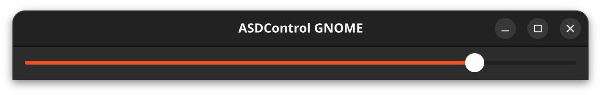

# asdcontrol - GNOME GUI

This is a small GUI app that talks to [Apple Display Brightness Control](https://github.com/nikosdion/asdcontrol) application.

The asdscontrol app is a simple command that uses USB protocol to communicate with an Apple Studio Display on Linux.

This is very handy, unfortunately, it doesn't offer a GUI, which was annoying enough for me that I decided to learn some
GTK development and write one myself.

## Features

On app start it checks if asdcontrol is installed, then tries to detect the display address by trying out all dev/|usb/hiddev devices with asdcontrol.

If any of those fails, you'd see a modal dialog that it failed. No more support, feel free to debug it yourself.

If it does work, it offers a simple GTK slider where you can control your brightness.

## Build

I experimented with different languages for GTK, but settled on Rust as it seems to be the nicest of all available ones.

And I didn't want to do js as it's my job-language and I wanted to do something different.

To build it, ensure you have rust development stuff on your machine, then build it. Luckily in Rust it's that easy.

## Contribute

If you want to improve it, feel free to propose a PR.
