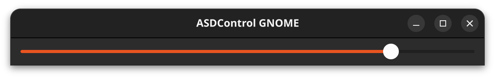

# asdcontrol - GNOME GUI



This is a small GUI app that directly controls the brightness of Apple Studio Displays on Linux using the USB HID protocol.

## Features

- **Multi-display support**: Automatically detects all connected Apple Studio Displays
- **Direct USB HID communication**: No external dependencies - talks directly to the displays via Linux hiddev
- **Simple GTK interface**: Clean, minimal sliders for brightness control
- **Per-display control**: Each detected display gets its own slider

On app start, it scans `/dev/hiddev*` and `/dev/usb/hiddev*` devices to find all compatible Apple displays (Studio Display 27" and Pro XDR Display 32").

If no displays are found, a message is shown. Otherwise, you'll see a brightness slider for each detected display.

## Build

I experimented with different languages for GTK, but settled on Rust as it seems to be the nicest of all available ones.

And I didn't want to do js as it's my job-language and I wanted to do something different.

To build it, ensure you have rust development stuff on your machine, then build it. Luckily in Rust it's that easy.

```bash
cargo build --release
```

## udev rules

By default, HID devices are owned by root and not accessible to regular users. You need to create udev rules to grant access.

**Important**: The `GROUP="users"` in the examples below may need to be changed to match your user's primary group. Run `groups` to check your groups.

- On **Debian/Ubuntu**, use `GROUP="users"` (default)
- On **Fedora/RHEL**, use `GROUP="wheel"`

**For Apple Studio Display (2022, 27")**

Create `/etc/udev/rules.d/50-apple-studio.rules`:

```bash
sudo tee /etc/udev/rules.d/50-apple-studio.rules <<EOF
KERNEL=="hiddev*", ATTRS{idVendor}=="05ac", ATTRS{idProduct}=="1114", GROUP="users", OWNER="root", MODE="0660"
EOF
```

**For Apple Pro XDR Display (2019, 32")**

Create `/etc/udev/rules.d/50-apple-xdr.rules`:

```bash
sudo tee /etc/udev/rules.d/50-apple-xdr.rules <<EOF
KERNEL=="hiddev*", ATTRS{idVendor}=="05ac", ATTRS{idProduct}=="9243", GROUP="users", OWNER="root", MODE="0660"
EOF
```

**Apply the rules:**

```bash
sudo udevadm control --reload-rules
sudo udevadm trigger
```

## Troubleshooting

### "No Apple Studio Displays detected"

**Check if the display is recognized by USB:**
```bash
lsusb | grep -E '05ac:(1114|9243)'
```

You should see something like:
```
Bus 003 Device 005: ID 05ac:1114 Apple, Inc. Studio Display
```

**Check device permissions:**
```bash
ls -la /dev/hiddev*
```

The hiddev devices should be owned by your user's group (e.g., `crw-rw---- 1 root users`). If not, your udev rules may not be applied correctly.

**Verify you're in the correct group:**
```bash
groups
```

If you're not in the `users` group (on Fedora you're likely in `wheel`), update the udev rule accordingly.

### Permission denied

If you get permission errors when trying to open the display:

1. Check which hiddev device corresponds to your display: `ls -la /dev/hiddev*`
2. Verify the device permissions include your group
3. Apply the udev rules as shown above
4. Unplug and replug the display, or reboot to ensure rules take effect

## Acknowledgments

This project took a lot from [asdcontrol](https://github.com/nikosdion/asdcontrol) by Nicholas K. Dionysopoulos.

The original asdcontrol is a command-line tool that provides brightness control for Apple displays on Linux. This GNOME GUI wraps similar functionality in a GTK4 interface.

## Contribute

If you want to improve it, feel free to propose a PR.
